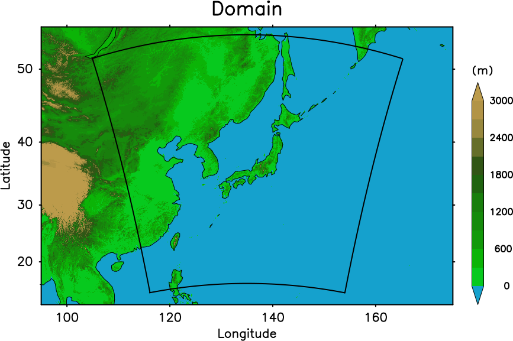

## Overview

This is a real case experiment of a 6-hourly data assimilation of NCEP PREPBUFR conventional observation set in a Japan domain with a 18-km grid.  
The basic configuration follows [Lien et al. (2017)](https://doi.org/10.2151/sola.2017-001).

## Computational domain

| | |
| --- | --- |
| Target area | Japan |
| Map projection | Lambert conformal conic projection|
| dx | 18 km |
| Model top | 28.8 km |
| levels | 36 |
| dt | 40 sec |
| Number of processes | 8 |
| Number of subdomain in X | 4 |
| Number of subdomain in Y | 2 |



## Data

### PREPBUFR  
The PREPBUFR obervation data set is obtained from NCEP NOMAD (https://nomads.ncep.noaa.gov/pub/data/nccf/com/gfs/prod). No user registration is required.  
The original data in wgrib2 format needs to be decoded and converted to [LETKF observation file format](Observation-file-format.md) before the experiment. Superobservation, observation selection or thinning treatment may be performed along with it.  
In this testcase, converted observation files in `$DATADIR/scale-letkf-test-suite/obs/prepbufr_Japan/` can be used. 

### Ensemble initial condition
To initiate a data assimilation cycle, it is necessary to create an ensemble of initial model states in a form of restart files. The natural way to create initial conditions to start DA cycle is to add random perturbations to the true state. In this testcase, a pre-prepared set of restart files located in `$DATADIR/scale-letkf-test-suite/exp/18km_Japan/init` can be used. 

### Boundary condition

The model needs 3-D atmospheric variable data for lateral boundary conditions. Boundary data files are needed in a special SCALE-RM format that are prepared by the executable `scale-rm_init_ens`. In this testcase experiment, NCEP GFS forecast data is used as the original data to create the boundary conditions. There are pre-prepared set of boundary files located in `$DATADIR/scale-letkf-test-suite/exp/18km_Japan/bdy/mean`. 

There is an option to use different boundary conditions for different members, by setting `BDY_ENS=1` in `config.main`. In this case, boundary data for each member needs to be prepared.  

## Run a data assimilation cycle

Copy files in `run/config/18km_Japan` to `run` .  
```
cd scale/run
cp -r config/18km_Japan/* . 
ln -s config.main.FUGAKU config.main  ### Fugaku
ln -s config.main.Linux_torque config.main  ### hibuna
```

The main settings are in `config.cycle`. Make sure that `MAKEINIT=0` as this experiment uses a pre-made initial ensemble. `STIME` is the initial time to start the first cycle, and `ETIME` is for the last cycle. If they are same, only one cycle is performed.

```
STIME='20220101000000'
ETIME='20220101060000'
TIME_LIMIT='00:30:00'


ISTEP=
FSTEP=
CONF_MODE='static'

#===============================================================================

FCSTOUT=

ADAPTINFL=0      # Adaptive inflation
                 #  0: OFF
                 #  1: ON

#===============================================================================

MAKEINIT=0       # 0: No
                 # 1: Yes
```

The periods of the cycle and observation window are set in this part of `config.main`. This experiment utilizes "4D-LETKF", in which observations within a time window with a finite period will be assimilated. With the settings below, observations less than 3 hours away from the assimilation time are included. When the cycle starts at 00Z for example, observations from 03Z to 09Z are assimilated to create analysis at 06Z. For this purpose, the ensemble forecast is performed up to 9 hours from 00Z, as the LETKF needs ensemble first-guess field between 03-09Z. 

```
#===============================================================================
# Cycling settings

WINDOW_S=10800     # SCALE forecast time when the assimilation window starts (second)
WINDOW_E=32400     # SCALE forecast time when the assimilation window ends (second)
LCYCLE=21600       # Length of a DA cycle (second)
LTIMESLOT=3600     # Timeslot interval for 4D-LETKF (second)
```

The paths to input data are set in `config.main`. This experiment assumes that the initial ensemble restart files and topo/landuse files are already made and placed in `$INDIR`. For boundary files, NCEP GFS data in GrADS format is in `$DATA_BDY_GRADS`. Observation data is in `$OBS`.

```
DIR="$(cd "$(pwd)/.." && pwd)"    # Root directory of the SCALE-LETKF

DATADIR=${SCALE_DB}          # Directory of the SCALE database

OUTDIR=/data/${GROUP}/$(id -nu)/test_scale/result/18km_Japan ### EDIT HERE ###
INDIR="$DATADIR/scale-letkf-test-suite/exp/18km_Japan/init"

#===============================================================================
# Location of model/data files

SCALEDIR="$DIR/../.."        # Directory of the SCALE model

DATA_TOPO="$DATADIR/scale-letkf-test-suite/exp/18km_Japan/init"   # Directory of the prepared topo files
DATA_TOPO_BDY_SCALE=
DATA_LANDUSE=$DATA_TOPO      # Directory of the prepared landuse files
DATA_BDY_SCALE=              # Directory of the boundary data in SCALE history format (parent domain)
DATA_BDY_SCALE_PRC_NUM_X=
DATA_BDY_SCALE_PRC_NUM_Y=
DATA_BDY_SCALE_PREP=         # Directory of the prepared SCALE boundary files
DATA_BDY_WRF=                # Directory of the boundary data in WRF format
DATA_BDY_NICAM=              # Directory of the boundary data in NICAM format (not finished)

DATA_BDY_GRADS="$DATADIR/scale-letkf-test-suite/exp/18km_Japan/bdy"

OBS="$DATADIR/scale-letkf-test-suite/obs/prepbufr_Japan"

```

Let's run the experiment by executing `cycle_run.sh`. It is recommendable to run the cycle in the background using the follownig command. 
```
nohup ./cycle_run.sh &> log_cycle_run &
```

While it is running, the progress status can be monitored from the LETKF log files after each cycle created in `$OUTDIR/<atime>/log/letkf/` (note that atime is `$STIME` plus 6 hours). 
For a quick check, find the observation departure statistics in the log file. 

```
OBSERVATIONAL DEPARTURE STATISTICS [GUESS] (IN THIS SUBDOMAIN):
==================================================================
                 U           V           T           Q          PS
------------------------------------------------------------------
BIAS     7.600E-01   4.386E-01         N/A         N/A  -1.932E+02
RMSE     2.076E+00   2.368E+00         N/A         N/A   2.295E+02
NUMBER        1205        1205           0           0         182
==================================================================
OBSERVATIONAL DEPARTURE STATISTICS [GUESS] (GLOBAL):
==================================================================
                 U           V           T           Q          PS
------------------------------------------------------------------
BIAS     1.764E-02   7.334E-01   3.690E-03   2.431E-05  -1.326E+02
RMSE     2.863E+00   2.631E+00   1.634E+00   4.179E-04   2.104E+02
NUMBER       14654       14654          93          36        1376
==================================================================
```
```
OBSERVATIONAL DEPARTURE STATISTICS [ANALYSIS] (IN THIS SUBDOMAIN):
==================================================================
                 U           V           T           Q          PS
------------------------------------------------------------------
BIAS     5.967E-01   4.044E-01         N/A         N/A  -1.262E+02
RMSE     1.960E+00   2.160E+00         N/A         N/A   1.723E+02
NUMBER        1205        1205           0           0         182
==================================================================
OBSERVATIONAL DEPARTURE STATISTICS [ANALYSIS] (GLOBAL):
==================================================================
                 U           V           T           Q          PS
------------------------------------------------------------------
BIAS    -1.437E-02   5.357E-01  -1.075E-01   2.920E-06  -8.016E+01
RMSE     2.389E+00   2.387E+00   1.584E+00   3.764E-04   1.708E+02
NUMBER       14654       14654          93          36        1376
==================================================================
```

After the job finishes successfully, first guess and analysis restart files at each analysis time step are stored in `$OUTDIR/<time>/gues/<member>` and `$OUTDIR/<time>/anal/<member>`. 
Output files are separated for each subdomain. You can use `sno` to combine separated files into one. You also have an option to perform regridding with sno plugins.  

## Run an ensemble forecast from analysis

Use the script `fcst_run.sh` to run an (extended) ensemble forecast from the anlaysis. The main settings are in `config.fcst`.  
Multiple forecasts can be performed simultaneously from a set of different initial times from `STIME` to `ETIME` every `LCYCLE`. If `STIME` to `ETIME` are the same, only an ensemble forecast from a single initial time is performed.  
Forecast length and output interval are specified by `FCSTLEN` and `FCSTOUT`. It is possible to perform an extended forecast longer than `LCYCLE`, as long as the original parent domain data for corresponding times are avaiable in a directory specified by `$DATA_BDY_GRADS`.  
Ensemble members to run forecast are specified by `MEMBERS`, separated by a blank. When `MEMBERS="all"`, all members (`MEMBER` in `config.main`) and "mean" are chosen. 

```
#===============================================================================
#
#  Settings for fcst.sh
#
#===============================================================================

STIME='20220101060000'
ETIME=$STIME
TIME_LIMIT='00:30:00'
MEMBERS='mean 0001 0002 0003 0004 0005'
CYCLE=
CYCLE_SKIP=1
ISTEP=
FSTEP=
CONF_MODE="static"

#===============================================================================
# Forecast settings

FCSTLEN=86400      # SCALE forecast length in the forecast mode (second)
FCSTOUT=3600

#===============================================================================

MAKEINIT=0       # 0: No
                 # 1: Yes
```

Now the analysis restart files to initialize the forecast are in the same location, as they are just made in the previous data assimilation cycle. Therefore `INDIR=$OUTDIR` in `config.main`.  

```
DIR="$(cd "$(pwd)/.." && pwd)"    # Root directory of the SCALE-LETKF

DATADIR=${SCALE_DB}          # Directory of the SCALE database

OUTDIR=/data/${GROUP}/$(id -nu)/test_scale/result/18km_Japan ### EDIT HERE ###
INDIR=${OUTDIR}
```

After the forecast job completes, the output files can be found in `$OUTDIR/<time>/fcst`, where <time> is the initial time of the forecast. Note that it is different from `$OUTDIR/<time>/hist` which is used in data assimilation. In the default setting, both history and restart files are created in fcst directory. The output setting is controlled by `OUT_OPT` in `config.fcst`. 

