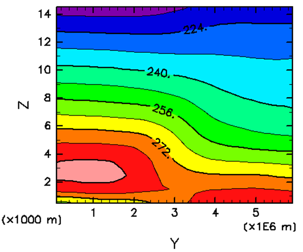
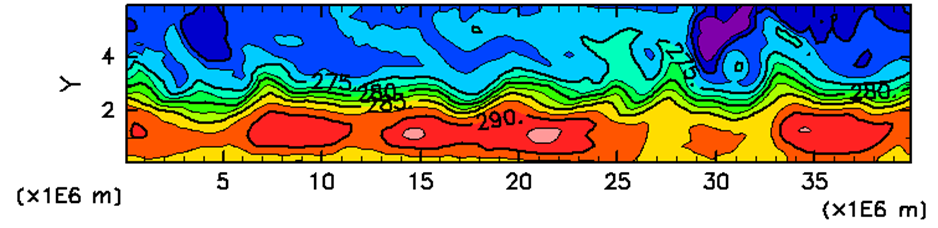

## Overview 

This is an idealized dry baroclinic waves experiment in a beta-plane channel domain, using the extension of the SCALE-RM testcase `scale-rm/test/case/barocwave/Ullrich15` ([Ullich et al. (2015)](https://rmets.onlinelibrary.wiley.com/doi/full/10.1002/qj.2583)).  
The state variables are nudged to a specific zonally-homogeneous reference state which is baroclinically unstable. The nudging time scales for temperature and horizontal winds are specified by the namelist parameters. Default setting is 10 days for temperature for the entire domain and 10 days for horizontal winds for levels below 3 km. 

The figure below shows the y-z cross section of the reference temperature field.   
<br>

The default size of the domain is 40000km in X, 6000km in Y, and 30km in Z. Boundary conditions are cyclic in X and static in Y. The Coriolis parameter and the beta correspond to the values at 45 degrees north. 
Integrating the model forward in time, baroclinic waves are repeatedly observed emerging and dissipating. After some spin-up period from an initial state with small perturbation, the state variables reach statistical equilibrium, while the time series is unsteady and non-periodic. 

The figure below shows the snapshot of RHOT at 2500m height level after long integration.  
<br>  

The model replicates the concept of spatiotemporal chaos in which initial perturbation grows with time, until the limit of predictability is reached. The basic properties of the strange attractor such as Lyapunov exponents can be obtained by integrating the model for sufficiently long period. In this sense, this model is analogous to Lorenz(1996) conceptual model and Held-Suarez(1994) global model.  

The prognostic state variables are DENS, MOMX, MOMY, MOMZ, and RHOT. In most cases, we analyse horizontal winds and temperature (U, V, T).

## Setup 

Copy directories and files in `run/config/barocwave` to `run` .  
```
cd scale/run
cp -r config/barocwave/* . 
ln -s config.main.FUGAKU config.main  ### Fugaku
ln -s config.main.Linux_torque config.main  ### hibuna
```

Compile scale-rm with the user-defined module `Ullich15_ext/mod_user.F90`. 
\* This experiment needs to be run with double precision. Set the environment variable `export SCALE_USE_SINGLEFP=F` before the compilation. 
```
cd Ullich15_ext
make -j
ls -a
```
Confirm the library `.libs` created there. 

Edit `scale/configure` as follows and compile the SCALE-LETKF with Ullrich15 extension version of SCALE.    
``` 
#SCALE_RM_OBJDIR = $(TOPDIR)/scale-rm/src/.libs$(POSTFIX)
SCALE_RM_OBJDIR = $(TOPDIR)/scale-letkf/scale/run/Ullrich15_ext/.libs$(POSTFIX)
```

Edit `run/config.main.${PRESET}` to setup the output path where experiment results are stored. 
```
OUTDIR=/home/$(id -nu)/test_scale/result/barocwave ### EDIT HERE ###
```

## Prepare nature run and observation

In this experiment, an idealized observation system simulation experiment (OSSE) is performed.
In OSSE, the "nature run" is performed first to create an high-resolution model simulation of the true nature of the atmosphere. Then synthetic observation data is generated from the nature run with a specific observation operator and random noise.

### Create reference state 

This baroclinic wave experiment requires a reference state, to which the state variables are relaxed. First of all, let's make them using scale-rm_init. 

Edit `config.fcst` as follows. With `FSTEP=2`, the script will run only `scale-rm_init_ens` and stop before the main step `scale-rm_ens`. When `MEMBERS='mean'` is specified, the model runs with only 'mean' member regardless of the value `MEMBER` in config.main.  
```
STIME='20000101000000'
ETIME=$STIME
TIME_LIMIT='00:10:00'
MEMBERS='mean'
CYCLE=1
CYCLE_SKIP=1
ISTEP=1
FSTEP=2
CONF_MODE="static"
```

Edit `config.nml.scale_init` as follows, setting zero perturbation to make zonally homogeneous reference state. 
```
&PARAM_MKINIT_BAROCWAVE
 REF_TEMP   = 288.D0,
 REF_PRES   = 1.D5,
 LAPSE_RATE = 5.D-3,
 Phi0Deg    = 45.D0,
 U0         = 35.D0,
 b          = 2.D0,
!!! Up         = 1.D0,
 Up         = 0.D0,
/
```

With those modified config files, execute `fcst_run.sh`. 
Resultant initial files will be created in the path specified by `$OUTDIR`. Rename them as refstate data. 
```
cd ../../../../result/barocwave ### $OUTDIR
mkdir refstate
for pe in `seq -f %06g 0 39` ; do mv 20000101000000/anal/mean/init_20000101-000000.000.pe${pe}.nc refstate/refstate.pe${pe}.nc; done
```

Set the namelist parameter REFSTATE_IN_BASENAME in `run/config.nml.scale_user` to the path of the refstate files. 
```
&PARAM_USER
...
 REFSTATE_IN_BASENAME="(your $OUTDIR)/refstate/refstate",
```

### Spinup

Now back to `run` directory again and prepare config files for the nature run. The length of the nature run is arbitrary, as long as it is sufficiently long. In this example, 1-year integration is performed for a spinup and then another 1-year integration is performed to create restart and history files of nature run. 
For the first integration, set `config.fcst` as follows.
 
```
STIME='20000101000000'
ETIME=$STIME
TIME_LIMIT='02:00:00'
MEMBERS='mean'
CYCLE=1
CYCLE_SKIP=1
ISTEP=1
FSTEP=3
CONF_MODE="static"

#===============================================================================
# Forecast settings

FCSTLEN=$((366*86400))      # SCALE forecast length in the forecast mode (second)
FCSTOUT=86400
RESTARTOUT=$FCSTLEN

#===============================================================================

MAKEINIT=1       # 0: No
                 # 1: Yes
```

Resume original settings of `config.nml.scale_init` as follows. 
```
&PARAM_MKINIT_BAROCWAVE
 REF_TEMP   = 288.D0,
 REF_PRES   = 1.D5,
 LAPSE_RATE = 5.D-3,
 Phi0Deg    = 45.D0,
 U0         = 35.D0,
 b          = 2.D0,
 Up         = 1.D0,
/
```

Let's look through PARAM_USER in `config.nml.scale_user`. The path to the refstate files just created is specified here. Nudging time scale as a function of height can be modified by changing these parameters. 
```
&PARAM_USER
 USER_do = .true.,
 REFSTATE_IN_BASENAME = "/home/myname/test_scale/result/barocwave/refstate/refstate",
 NUDGE_UV_DAY_TOP = -999.9,
 NUDGE_UV_DAY_BOT = 10.0,
 NUDGE_UV_TRANS_HEIGHT = 3.0D3,
 NUDGE_UV_TRANS_WIDTH  = 1.0D3,
 NUDGE_T_DAY_TOP  = 10.0,
 NUDGE_T_DAY_BOT  = 10.0,
 NUDGE_T_TRANS_HEIGHT = 3.0D3,
 NUDGE_T_TRANS_WIDTH  = 1.0D3,
/
```

Execute `fcst_run.sh` to integrate the model. There will be restart files such as `$OUTDIR/20000101000000/fcst/mean/init_20010101-000000.000.peXXXXXX.nc`. Create a directory `$OUTDIR/20010101000000/anal/mean/` and move those restart files into that directory. They will be used to initialize the next integration for the nature run. 

### Nature run

Edit `config.fcst` as follows. This time `MAKEINIT=0`, as the restart files are already made.   
Set `RESTARTOUT=86400` so that restart files are created every 1 day during the integration.  
 
```
STIME='20010101000000'
ETIME=$STIME
TIME_LIMIT='02:00:00'
MEMBERS='mean'
CYCLE=1
CYCLE_SKIP=1
ISTEP=1
FSTEP=3
CONF_MODE="static"

#===============================================================================
# Forecast settings

FCSTLEN=$((365*86400))      # SCALE forecast length in the forecast mode (second)
FCSTOUT=86400
RESTARTOUT=86400

#===============================================================================

MAKEINIT=0       # 0: No
                 # 1: Yes
```

Execute `fcst_run.sh` again and move to `$OUTDIR`. The resultant files will be considered as restart and history data of the nature run. Rename them as follows. 

```
cd ../../../../result/barocwave ### $OUTDIR
mkdir -p nature/init nature/hist
mv 20010101000000/anal/mean/init_*.nc nature/init/
mv 20010101000000/fcst/mean/init_*.nc nature/init/
mv 20010101000000/fcst/mean/history*.nc nature/hist/
```

### Post-processing and quicklook of the nature run

Original output files of SCALE are separated for each process. Generate a combined history file of nature run using SNO (Scale NetCDF Operator), a post-processing tool included in SCALE.  
You can select variables to be included in a combined file, and optionally you can perform regridding by editing SNO namelist parameters.  
The combined history file will be used below in order to obtain grid configuration.  

### Synthetic observation

Prepare 'synthetic' observation based on the nature run history data using the program `scale/obs/obsmake`. 
First, the location and error of observations need to be specified. There are sample fortran programs in `make_obsin` directory. Compile and run `sample_3dgrid_xyp.f90` to obtain `test_obs_3d_xyp.txt`. 
By default, observation grid points for U, V, and T are set at every 4 grids in horizontal and every 2 grids in vertical directions. 

```
cd make_obsin
ln -s (file path)/history_merge.pe000000.nc .
gfortran common_ncio.f90 sample_3dgrid_xyp.f90 -lnetcdf -lnetcdff -I (netcdf-fortran include directory path)
./a.out
```

The format of the output file 'test_obs_3d_xyp.dat' is the same as the LETKF observation files, including information such as location, type, error standard deviation of each observation. The data part is filled with dummy values. See also [Observation file format](Observation-file-format.md).  

Edit `config.obsmake`. The observation files will be created every `$FCSTOUT` seconds from `$STIME` to `$ETIME`. Observation of U, V, T are created from the data in `$OUTPUT/nature/hist/` with additive noise which have a standard deviation specified by namelist parameters such as `OBSERR_U` of PARAM_OBS_ERR. 
```
#===============================================================================
#
#  Settings for obsmake_run.sh
#
#===============================================================================

STIME='20010101000000'
ETIME='20010131000000'
TIME_LIMIT='01:00:00'
CYCLE=1

BASETIME='20010101000000' ### nature/hist/history.pe000000.nc
FCSTOUT=86400

OBSIN=$SCRP_DIR/make_obsin/test_obs_3d_xyp.dat
OBS_IN_FORMAT="PREPBUFR"
```

Execute `obsmake_run.sh` and obtain observation files in the path specified by `$OBS` in `config.main`.

## Prepare ensemble of initial states

To initiate a data assimilation cycle, it is necessary to create an ensemble of initial model states, in the form of restart files. Suppose that we start a data assimilation cycle from 20010101000000. The natural way to create initial conditions to start with is adding random perturbation to the true state. 

A python script `init_perturb/init_perturb.py` is designed to do this task. 
Modify the setting in this script to the following values. 
```
wavel1 =  500000.  ### short-wave cutoff wavelength
wavel2 = 2000000.  ### long-wave  cutoff wavelength
dx = 200000.       ### horizontal grid spacing
zheight = 16000.   ### top height for perturbation (can be below the model top)
taper_width = 10  ### number of grid points to suppress perturbation near the lateral boundary
taper_mtop = 10   ### number of grid points to suppress perturbation near the top level

pert_std = 1.0    ### STANDARD DEVIATION (in Kelvin) of temperature perturbation
halo = 2          ### number of grid points for HALO
```

Use the shell script wrapper `init_perturb/init_perturb.sh` to create restart files with random additional perturbations for each member. This script uses `$OUTDIR` and `$MEMBER` in `config.main`. Only the target time and the path to the source file need to be specified.   
```
cd init_perturb
./init_perturb.sh 20010101000000 ../../../../../result/barocwave/nature/init/init_20010101-000000.000
```

## Run a data assimilation cycle

Finally you are ready to start a data assimilation cycle. 
The main settings are in `config.cycle`. Make sure that `MAKEINIT=0` as this experiment uses initial ensemble that has just been created externally. `STIME` is the initial time to start the first cycle, and `ETIME` is for the last cycle. If they are same, only one cycle is performed.

```
STIME='20010101000000'
ETIME='20010131000000'
TIME_LIMIT='01:00:00'

ISTEP=
FSTEP=
CONF_MODE='static'

#===============================================================================

FCSTOUT=

ADAPTINFL=0      # Adaptive inflation
                 #  0: OFF
                 #  1: ON

#===============================================================================

MAKEINIT=0       # 0: No
                 # 1: Yes
```

The periods of the cycle and observation window are set in this part of `config.main`. In this experiment, `LCYCLE` is same as the observation interval which is 1 day. The rest three parameters shown below are set to be the same with `LCYCLE`,,i.e. 86400, which means only the observations at the very time of the analysis will be used (3D-LETKF).

```
LCYCLE=86400       # Length of a DA cycle (second)
WINDOW_S=86400     # SCALE forecast time when the assimilation window starts (second)
WINDOW_E=86400     # SCALE forecast time when the assimilation window ends (second)
LTIMESLOT=86400     # Timeslot interval for 4D-LETKF (second)
```

Let's run the experiment by executing `cycle_run.sh`. It is recommended to run the script in the background. 
```
nohup ./cycle_run.sh &> log_cycle_run &
```

While it is running, the progress status can be monitored with the log files of letkf in each cycle created in `$OUTDIR/<time>/log/letkf/`. 
For a quick check, find the observation departure statistics in the log file. 

```
OBSERVATIONAL DEPARTURE STATISTICS [GUESS] (IN THIS SUBDOMAIN):
==================================================================
                 U           V           T           Q          PS
------------------------------------------------------------------
BIAS    -3.100E-03  -8.795E-02   1.626E-01         N/A         N/A
RMSE     1.175E+00   1.018E+00   9.706E-01         N/A         N/A
NUMBER         112         112         112           0           0
==================================================================
OBSERVATIONAL DEPARTURE STATISTICS [GUESS] (GLOBAL):
==================================================================
                 U           V           T           Q          PS
------------------------------------------------------------------
BIAS    -1.157E-03  -7.139E-03  -7.748E-03         N/A         N/A
RMSE     1.292E+00   1.248E+00   1.033E+00         N/A         N/A
NUMBER        5027        5033        5033           0           0
==================================================================
```
```
OBSERVATIONAL DEPARTURE STATISTICS [ANALYSIS] (IN THIS SUBDOMAIN):
==================================================================
                 U           V           T           Q          PS
------------------------------------------------------------------
BIAS     4.250E-02   4.522E-02   1.262E-01         N/A         N/A
RMSE     6.394E-01   7.838E-01   8.666E-01         N/A         N/A
NUMBER         112         112         112           0           0
==================================================================
OBSERVATIONAL DEPARTURE STATISTICS [ANALYSIS] (GLOBAL):
==================================================================
                 U           V           T           Q          PS
------------------------------------------------------------------
BIAS     4.256E-03  -3.297E-03  -5.535E-03         N/A         N/A
RMSE     8.824E-01   9.606E-01   9.439E-01         N/A         N/A
NUMBER        5027        5033        5033           0           0
==================================================================
```

After the job finishes successfully, first guess and analysis restart files at each analysis time step are stored in `$OUTDIR/<time>/gues/<member>` and `$OUTDIR/<time>/anal/<member>`. 


