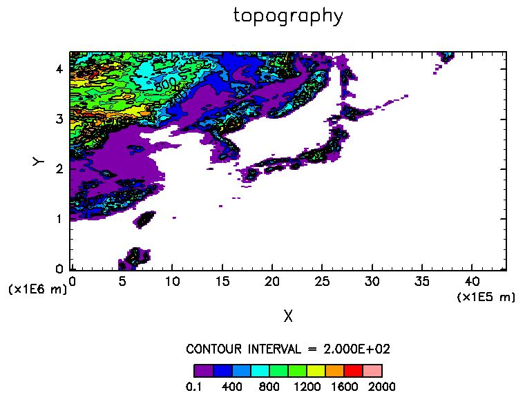
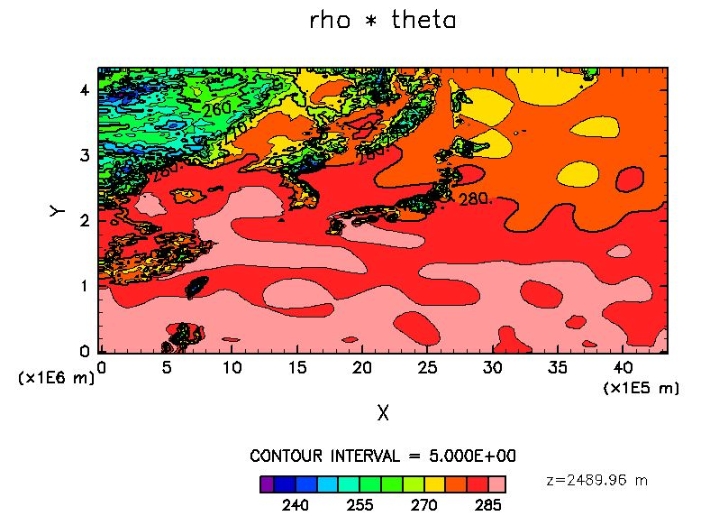
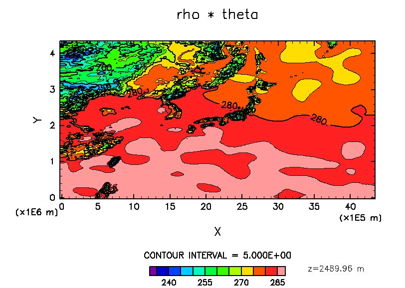

## Environmental variables 

Before compiling the SCALE-LETKF, set the following environmental variables as below. 

```bash
### hibuna
export SCALE_SYS="Linux64-gnu-ompi"
export SCALE_DB="/home/amemiya/scale_database" ### or your own directory
export SCALE_ENABLE_OPENMP=F
export SCALE_ENABLE_PNETCDF=F
export SCALE_NETCDF_INCLUDE="-I/home/seiya/include -I/ap/HDF5/1.8.16/include"
export SCALE_NETCDF_LIBS="-L/home/seiya/lib -L/ap/HDF5/1.8.16/lib -lnetcdff -lnetcdf"
### Fugaku
export GROUP=<your group number> ### not Fugaku but hpXXXXXX or raXXXXXX
export SCALE_SYS="FUGAKU"
export SCALE_DB=<path to your directory> ### your own directory
export SCALE_ENABLE_OPENMP=T
export SCALE_ENABLE_PNETCDF=F
```

The following environmental variables are optional and not nesessary. 
```bash
export SCALE_USE_SINGLEFP=T
export SCALE_QUICKDEBUG=T
export SCALE_DEBUG=T
```

On Fugaku, some libraries such as NetCDF need to be loaded and linked from [spack](https://www.fugaku.r-ccs.riken.jp/doc_root/ja/user_guides/FugakuSpackGuide/). 
The sample script to do this job can be found in the database directory. 
```bash
source <your $SCALE_DB>/setup-scale-compile.sh
```

**For fugaku users:**
Be sure to copy the database `/share/hp150019/scale_database` to your directory under /vol0003 or /vol0004, as /share is not accesible directly from the compute node.   
Set the environmental variable `$SCALE_DB` to the path of the scale_database copied to your directory.

## Compile SCALE-RM

```bash
git clone https://github.com/scale-met/scale.git
cd scale/scale-rm/src
make -j
```

For more information, please refer to [SCALE user's guide](https://scale.riken.jp/documents/). 

<!--
**For fugaku users:**
If you have errors about loading spack in compilation, change `sysdep/Makedef.FUGAKU` as follows. 

``` 
 SCALE_NETCDF_C ?= $(shell spack location --install-dir netcdf-c%fj@$(SPACK_FJVER))
 SCALE_NETCDF_F ?= $(shell spack location --install-dir netcdf-fortran%fj@$(SPACK_FJVER))
 SCALE_PNETCDF ?= $(shell spack location --install-dir parallel-netcdf%fj@$(SPACK_FJVER))
 SCALE_HDF ?= $(shell spack location --install-dir hdf5%fj@$(SPACK_FJVER)+hl~fortran)
```
-->
## Compile SCALE-LETKF

```bash
git clone https://github.com/SCALE-LETKF-RIKEN/scale-letkf.git -b develop 
cd scale-letkf/scale
make -j
```

Compile options are in `arch/configure.${SCALE_SYS}`. 
```make:configure.FUGAKU
# Precision
LETKF_SINGLE_FP = F

# MP-PAWR decoder

USE_PAWR_DECODER = F

ENABLE_SAITAMA_MPW = F
``` 

**Note** The PAWR decoder is usually not used. If you enable it, you need to use it along with the [alternative version of SCALE](https://github.com/scale-met/scale-dev/tree/5.5.x_LETKF), otherwise you get errors in compilation.  

Check if all the binary files are created after the compilation. 

```bash
ensmodel/scale-rm_pp_ens
ensmodel/scale-rm_init_ens
ensmodel/scale-rm_ens
letkf/letkf
letkf/efso
```

## Run a test script

The directory `scale-letkf/scale/run_light` provides a set of simple scripts to test the SCALE-LETKF code on Fugaku.

First, enter the directory and specify the database path in `prep.sh`. 

```bash
LETKFDIR=${mydir}/..
SCALEDIR=${mydir}/../../..
DATADIR="/data/$(id -ng)/$(id -nu)/scale_database/scale-letkf-test-suite" ### path to your directory
```

Execute `prep.sh` and you will have symbolic links to the binary files `scale-rm_init_ens`, `scale-rm_ens`, and `letkf` in the directory. You can also find the links to input data files in the directories `0001`-`0005` and `mean`. 

Let us just run the script first.  

```bash
### Fugaku
pjsub exec_pjsub.sh 
### hibuna
qsub exec_qsub.sh 
```

After submitting your job, when the job starts running, the log file of the job script `exec_pjsub.sh.<jobid>.out` appears.
When the job is finished successfully, the log file shows the following texts.   
```txt:exec_pjsub.sh.<jobid>.out
scale-rm_init_ens
scale-rm_ens
letkf
done.
```
And you can find a pair of analysis and first guess data of each ensemble members and ensemble mean at `2022/01/01-06:00:00`. 
```bash
$ ls */*/init*pe000000.nc
0001/anal/init_20220101-000000.000.pe000000.nc  0004/anal/init_20220101-000000.000.pe000000.nc
0001/anal/init_20220101-060000.000.pe000000.nc  0004/anal/init_20220101-060000.000.pe000000.nc
0001/gues/init_20220101-060000.000.pe000000.nc  0004/gues/init_20220101-060000.000.pe000000.nc
0002/anal/init_20220101-000000.000.pe000000.nc  0005/anal/init_20220101-000000.000.pe000000.nc
0002/anal/init_20220101-060000.000.pe000000.nc  0005/anal/init_20220101-060000.000.pe000000.nc
0002/gues/init_20220101-060000.000.pe000000.nc  0005/gues/init_20220101-060000.000.pe000000.nc
0003/anal/init_20220101-000000.000.pe000000.nc  mean/anal/init_20220101-000000.000.pe000000.nc
0003/anal/init_20220101-060000.000.pe000000.nc  mean/anal/init_20220101-060000.000.pe000000.nc
0003/gues/init_20220101-060000.000.pe000000.nc  mean/gues/init_20220101-060000.000.pe000000.nc
```

In the batch job script `exec_pjsub.sh`, three binaries are executed in turn.

```bash
echo "scale-rm_init_ens"
mpiexec -std-proc log/scale_init/NOUT -n 48 ./scale-rm_init_ens config/scale-rm_init_ens_20220101000000.conf
echo "scale-rm_ens"
mpiexec -std-proc log/scale/NOUT -n 48 ./scale-rm_ens config/scale-rm_ens_20220101000000.conf
echo "letkf"
mpiexec -std-proc log/letkf/NOUT -n 48 ./letkf config/letkf_20220101060000.conf
echo "done."
```

After confirming that the script works, let's do it again step by step and see the necessary settings and input data at each step. 
First, remove the output files and temporary log files in the directory `run_light`, by running the script `clean.sh` and then executing `prep.sh` again.


## Run a test script (step by step)

The target domain is the area around Japan with the horizontal grid spacing of 18km.  


### scale-rm_init_ens

`scale-rm_init_ens` is a wrapper of `scale-rm_init` with multiple ensemble members. It calls the core program of `scale-rm_init` for each member inside, with corresponding separate namelist files. The namelist for the first member is `0001/init.d01_20220101000000.conf`.

The necessary input data includes 

- namelist file for the entire program (`config/scale-rm_init_ens_20220101000000.conf`)
- namelist file for each member (`0001/init.d01_20220101000000.conf`)
- topography/landuse data (`const/topo`, `const/landuse`)
- parent model data for boundary condition (`mean/bdyorg*.grd`)
- namelist file for parent model input (`mean/gradsbdy.conf`)
- output directory for log file (log/scale_init)

The output data includes

- boundary data (`mean/boundary*.nc`)
- log files

In this testcase, the initial conditions are already prepared and copied from `$DATADIR` for each member. The boundary conditions are created by `scale-rm_init_ens`. All the member share the same boundary condition generated from the parent model forecast. Thus `scale-rm_init_ens` only creates boundary conditions for the first member `0001`. This is set by the parameter `MEMBER_RUN` in the namelist `config/scale-rm_init_ens_20220101000000.conf`. 

``` 
&PARAM_ENSEMBLE
MEMBER = 5,
MEMBER_RUN = 1,
CONF_FILES = "<member>/init.d<domain>_20220101000000.conf",
CONF_FILES_SEQNUM = .false.,
DET_RUN = .false.,
DET_RUN_CYCLED = .true.,
/
```

Actually, you can do exactly the same thing by doing this in the batch job script `exec_pjsub.sh`. 
```
mpiexec -std-proc log/scale_init/NOUT -n 8 ./scale-rm_init 0001/init.d01_20220101000000.conf
```

The initial condition for each member is pre-made by a separate script. They are made by adding random perturbations to `RHOT` and `DENS` with a selected wavelength range to the background NCEP GDAS analysis. The `RHOT` fields of the first two members are shown below. 
  



### scale-rm_ens

Next, `scale-rm_ens` is a wrapper of `scale-rm` with multiple ensemble members. It calls the core program of `scale-rm` for each member inside, with corresponding separate namelist files. The namelist for the first member is `0001/run.d01_20220101000000.conf`.

The necessary input data includes 

- namelist file for the entire program (`config/scale-rm_ens_20220101000000.conf`)
- namelist file for each member (`0001/run.d01_20220101000000.conf`)
- topography/landuse data (`const/topo`, `const/landuse`)
- initial condition files (`<member>/anal/init_20220101-000000.000.*.nc`)
- boundary files (`mean/boundary*.nc`)
- output directory for log file (log/scale)

The output data includes

- restart files (`<member>/gues/init_20220101-060000.000.*.nc`)
- history files (`<member>/hist/history*.nc`)
- log files

Again, the same task can be done by executing `scale-rm` repeatedly (or in parallel as a bulk job).
```
for mem in 0001 0002 0003 0004 0005 mean;
  mpiexec -std-proc log/scale_init/NOUT -n 8 ./scale-rm ${mem}/init.d01_20220101000000.conf
done
```

Both restart and history files are necessary in this testcase, as we will perform 4-D LETKF. 
Note that the ensemble forecast is performed from `2022-01-01 00:00:00` to `2022-01-01 09:00:00`, whereas the restart files are created at `2022-01-01 06:00:00`. 

Also note that the original restart files `<member>/gues/init_20220101-060000.000.*.nc` are copied to `<member>/anal/init_20220101-060000.000.*.nc`. This is preresquite for LETKF which does not create but overwrite NetCDF files. 

### letkf 

The necessary input data includes 

- namelist file for the program (`config/letkf_20220101060000.conf`)
- topography/landuse data (`const/topo`, `const/landuse`)
- restart files to overwrite (`<member>/anal/init_20220101-060000.000.*.nc`)
- history files (`<member>/hist/history*.nc`)
- observation files (`obs/obs_20220101060000.nc`)
- output directory for log file (log/letkf)

The output data includes

- restart files (overwrite) (`<member>/gues/init_20220101-060000.000.*.nc`)
- log files

The observation data in this case is [PREPBUFR](https://dtcenter.org/community-code/gridpoint-statistical-interpolation-gsi/observation-data) used in NCEP GDAS. The assimilation time window is 6 hours from "2022-01-01 03:00:00" to "2022-01-01 09:00:00". The time series of background ensemble forecast data is loaded from history files and transformed to observation space. The resultant analysis mean and each member fields are overwritten to `<member>/anal/init_20220101-060000.000.*.nc`. 

To quickly check if the LETKF works, see the log file `log/letkf/NOUT.3.0`. The observation departure statistics before and after the LETKF indicates how the misfit between the background (forecast ensemble mean) and the observation is reduced by the data assimilation. 

```txt
OBSERVATIONAL DEPARTURE STATISTICS [GUESS] (GLOBAL):
==================================================================
                 U           V           T           Q          PS
------------------------------------------------------------------
BIAS     2.317E-02   7.718E-01   1.208E-02   2.321E-05  -1.346E+02
RMSE     3.009E+00   2.762E+00   1.717E+00   4.158E-04   2.145E+02
NUMBER       14652       14654          93          36        1379
==================================================================

OBSERVATIONAL DEPARTURE STATISTICS [ANALYSIS] (GLOBAL):
==================================================================
                 U           V           T           Q          PS
------------------------------------------------------------------
BIAS    -2.040E-02   7.287E-01   1.227E-02   2.174E-05  -1.137E+02
RMSE     2.821E+00   2.636E+00   1.634E+00   4.204E-04   1.955E+02
NUMBER       14652       14654          93          36        1379
==================================================================
``` 
