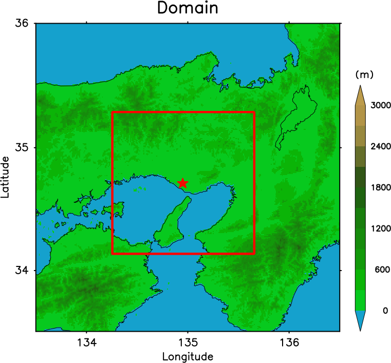
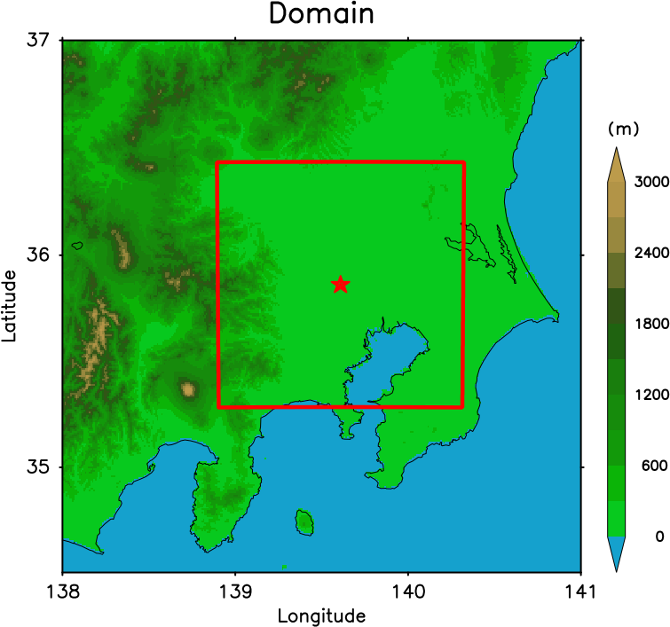
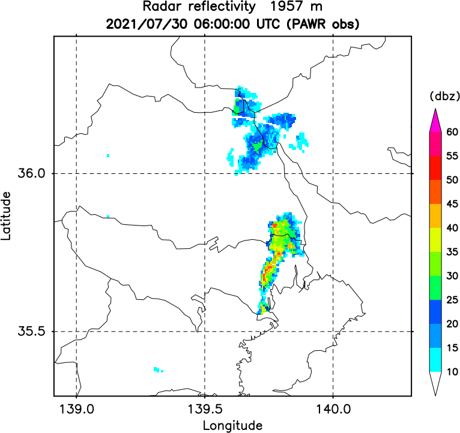

## Overview

This is a real case experiment of a 30-second data assimilation of Phased Array Weather Radar (PAWR)  with 500 m grid. This testcase supports two PAWRs at Kobe and Saitama. The basic configuration of Saitama MP-PAWR data assimilation follows [Honda et al. (2022)](https://doi.org/10.1029/2021MS002823).

## Computational domain

| | |
| --- | --- |
| Target area | Kansai / Kanto |
| Map projection | Mercator |
| dx | 500 m |
| Model top | 16.4 km |
| levels | 45 |
| dt | 2 sec |
| Number of processes | 16 |
| Number of subdomain in X | 4 |
| Number of subdomain in Y | 4 |


  

## Target events

The test experiment for Saitama MP-PAWR is on the heavy thunderstorm event that occurred over central Tokyo on July 30, 2021.  



## Data

### PAWR observation

PAWR observation data is obtained from NICT in a specific binary format, containing the header for the metadata and the observation data in a 3-D polar coordinate. The format is different between Kobe and Saitama PAWR, as Saitama PAWR is dual-polarization type (called Multi-Parameter\[MP\]-PAWR) whereas Kobe is not (as of 2022). In this testcase, radar reflectivity and Doppler velocity from both radars are used in data assimilation.  
SCALE-LETKF reads PAWR observation data in its common [observation file format](Observation-file-format.md). To convert raw PAWR data to the common format, this SCALE-LETKF code includes the PAWR decorder.   

This testcase uses PAWR sample observation data in the following directory, where `$SCALE_DB` is the path to the directory in your data space.  
`$SCALE_DB/scale-letkf-test-suite/obs/PAWR_Kobe`  
`$SCALE_DB/scale-letkf-test-suite/obs/PAWR_Saitama`

### Ensemble initial/boundary condition

The model needs the data of 3-D atmospheric variables for lateral boundary conditions. In this experiment, SCALE-RM ensemble forecast data with 1.5 km horizontal resolution, which is driven by JMA MSM (5 km) analysis and forecast, is used as a source data. Unlike the [18km-Japan](18km_Japan.md) case, forecast data in the parent domain is also an ensemble, providing different boundary conditions for each ensemble member. 

The same ensemble forecast data can be used to prepare an initial ensemble with which a data assimilation cycle starts. (*Note that this simple downscaling treatment is probably not the best way to initiate ensemble data assimilation because the downscaled perturbation lacks fine-scale features which the parent model cannot capture with its limited resolution. This is known as a 'cold-start' problem and additive small-scale perturbation may improve the performance.*)

The parent domain ensemble forecast data is contained in the following directories. 
`$SCALE_DB/scale-letkf-test-suite/exp/PAWR_Kobe_bdy/20190610060000`
`$SCALE_DB/scale-letkf-test-suite/exp/PAWR_Saitama_bdy/20210730000000`

## Compilation 

The PAWR decoder is included in the directory `scale/obs/pawr` and considered as an extention of SCALE-LETKF code, which is switched off by default. To compile it, change the following variables in `scale/arch/configure.user.${SCALE_SYS}`.
```
# MP-PAWR decoder

USE_PAWR_DECODER = T

ENABLE_SAITAMA_MPW = T

``` 
Set `USE_PAWR_DECODER=T` to include the PAWR decoder. And set `ENABLE_SAITAMA_MPW=T` when Saitama MP-PAWR is used. 
Use GNU make with this setting and make a binary `scale/obs/dec_pawr`. 

**In the following, experiments with the Saitama MP-PAWR testcase is shown. Similar experiments can be done with Kobe PAWR case in the same way.**

## Run a data assimilation cycle with formatted PAWR data 

Copy directories and files in `run/config/PAWR_Saitama` to `run` .  
```
cd scale/run
cp -r config/PAWR_Saitama/* . 
ln -s config.main.FUGAKU config.main  ### Fugaku
ln -s config.main.Linux_torque config.main  ### hibuna
```

The common configurations shared between data assimilation and forecast experiments are set in `config.main`. The important settings in this testcase are shown below.   
Input data directory `$INDIR` and topography, landuse data directories `$DATA_TOPO`, `$DATA_LANDUSE` are all set to `$OUTDIR`, even though `$OUTDIR` does not exist. This means the tasks to create those files are all included in the data assimilation cycle. To ensure this, `TOPO_FORMAT='DEM50M'` and `LANDUSE_FORMAT='LU100M'` are set, instead of 'prep'. The source data for initial and boundary files is in `DATA_BDY_SCALE`. `BDY_FORMAT=1` indicates that it is the output of another SCALE-RM forecast with a wider domain. `BDYINT=600` and `BDYCYCLE_INT=32400` indicates the time interval and total length of that data. Finally, `BDY_ENS=1` indicates that those boundary source data is an ensemble forecast data and each member uses the corresponding member of the source data.   

```
OUTDIR=/data/${GROUP}/$(id -nu)/test_scale/result/PAWR_Saitama ### EDIT HERE ###
INDIR=$OUTDIR
#===============================================================================
# Location of model/data files
DATADIR=$SCALE_DB  # Directory of the SCALE database
DATA_BDY_SCALE=$DATADIR/scale-letkf-test-suite/exp/PAWR_Saitama_bdy # Directory of the boundary data in SCALE history format (parent domain)
DATA_TOPO_BDY_SCALE=$DATA_BDY_SCALE
DATA_TOPO=$INDIR                                # Directory of the prepared topo files
DATA_LANDUSE=$DATA_TOPO                         # Directory of the prepared landuse files
DATA_BDY_SCALE_PRC_NUM_X=4
DATA_BDY_SCALE_PRC_NUM_Y=2
OBS=$DATADIR/scale-letkf-test-suite/obs/PAWR_Saitama
#===============================================================================
# model/data file options

DET_RUN=0               # 0: Disable the deterministic run
TOPO_FORMAT='DEM50M'    
LANDUSE_FORMAT='LU100M' 
BDY_FORMAT=1            # 1: SCALE history (requires compatible 'config.nml.scale_init')
BDY_SINGLE_FILE=0       # 0: Length of a boundary file = $BDYCYCLE_INT (e.g., files made by data assimilation cycles)                       
BDY_ENS=1               # 1: Ensemble boundary files
BDYINT=600
BDYCYCLE_INT=32400
```

The data assimilation is performed **every 30 seconds** with 50 members, as set in the following. The parameters `WINDOW_S` and `WINDOW_E` are set to the same value with `LCYCLE`, indicating 3D-LETKF.   
```
#===============================================================================
# Cycling settings

WINDOW_S=30     # SCALE forecast time when the assimilation window starts (second)
WINDOW_E=30     # SCALE forecast time when the assimilation window ends (second)
LCYCLE=30       # Length of a DA cycle (second)
LTIMESLOT=30     # Timeslot interval for 4D-LETKF (second)

#===============================================================================
# Parallelization settings

MEMBER=50         # Ensemble size
```

First, disable PAWR decoder and use the pre-made PAWR data in the common observation format in `$OBS` directory. Edit "PAWR decoder" part as follows. 
```
#===============================================================================
# PAWR decoder
PAWR_DECODE=0
#PAWR_DECODE=1
#PAWR_RAW="$DATADIR/scale-letkf-test-suite/obs/PAWR_Saitama/raw"
#FNAME_PAWR_RAW="obs.pawr<type>"
#OBS="$INDIR/obs_letkf"
```

The main settings for data assimilation cycle are in `config.cycle`. `STIME` is the initial time to start the first cycle, and `ETIME` is for the last cycle. If they are same, only one cycle is performed. In this default setting, 20 cycles from 2021-07-30 06:00:00 UTC to 2021-07-30 06:10:00 UTC
 are performed. `MAKEINIT=1` is necessary, as the initial ensemble is not pre-made in `$INDIR` and will be created by `scale-rm_init_ens` step from the boundary source data.  
```
#===============================================================================
#
#  Settings for cycle.sh
#
#===============================================================================

STIME='20210730060000'
ETIME='20210730060930'
#ETIME=$STIME
TIME_LIMIT='00:30:00'

ISTEP=
FSTEP=
CONF_MODE='static'

#===============================================================================

FCSTOUT=30

ADAPTINFL=0      # Adaptive inflation
                 #  0: OFF
                 #  1: ON

#===============================================================================

MAKEINIT=1       # 0: No
                 # 1: Yes

```

Let's run the experiment by executing `cycle_run.sh`. 
```
nohup ./cycle_run.sh &> log_cycle_run &
```

While it is running normally, the log file of the batch job in the runtime directory `scale/tmp/scale-letkf_PAWR_Saitama` (The log file name depends on the system. On Fugaku, `cycle_job.sh.<jobid>.out`.) shows the progress like the following. 
```
[2022-06-15 20:55:09] 20210730060530: Run SCALE pp ...skipped (already done in the first cycle)
[2022-06-15 20:55:09] 20210730060530: Run SCALE init
[2022-06-15 20:55:09] 20210730060530: Run SCALE init: 1: start
[2022-06-15 20:55:26] 20210730060530: Run SCALE init: 1: end
[2022-06-15 20:55:26] 20210730060530: Run ensemble forecasts
[2022-06-15 20:55:26] 20210730060530: Run ensemble forecasts: 1: start
[2022-06-15 20:55:49] 20210730060530: Run ensemble forecasts: 1: end
[2022-06-15 20:55:49] 20210730060530: Run observation operator ...skipped (only use integrated observation operators and decoded data)
[2022-06-15 20:55:49] 20210730060530: Run LETKF
[2022-06-15 20:55:49] 20210730060530: Run LETKF: 1: start
[2022-06-15 20:56:06] 20210730060530: Run LETKF: 1: end
```

The progress status can be monitored with the letkf log files created in `$OUTDIR/<time>/log/letkf/` for each \<time\>. 
For quick check, find the observation departure statistics in the log file. 

```
OBSERVATIONAL DEPARTURE STATISTICS [GUESS] (IN THIS SUBDOMAIN):
==========================================================================================
                 U           V           T           Q          PS         REF          Vr
------------------------------------------------------------------------------------------
BIAS           N/A         N/A         N/A         N/A         N/A  -5.609E+00  -7.556E-01
RMSE           N/A         N/A         N/A         N/A         N/A   8.309E+00   1.841E+00
NUMBER           0           0           0           0           0        8756          28
==========================================================================================
OBSERVATIONAL DEPARTURE STATISTICS [GUESS] (GLOBAL):
==========================================================================================
                 U           V           T           Q          PS         REF          Vr
------------------------------------------------------------------------------------------
BIAS           N/A         N/A         N/A         N/A         N/A  -3.302E+00  -1.814E-01
RMSE           N/A         N/A         N/A         N/A         N/A   8.252E+00   2.312E+00
NUMBER           0           0           0           0           0      655763      100341
==========================================================================================
```
```
OBSERVATIONAL DEPARTURE STATISTICS [ANALYSIS] (IN THIS SUBDOMAIN):
==========================================================================================
                 U           V           T           Q          PS         REF          Vr
------------------------------------------------------------------------------------------
BIAS           N/A         N/A         N/A         N/A         N/A  -1.973E-01   9.685E-02
RMSE           N/A         N/A         N/A         N/A         N/A   1.316E+00   1.554E+00
NUMBER           0           0           0           0           0        8756          28
==========================================================================================
OBSERVATIONAL DEPARTURE STATISTICS [ANALYSIS] (GLOBAL):
==========================================================================================
                 U           V           T           Q          PS         REF          Vr
------------------------------------------------------------------------------------------
BIAS           N/A         N/A         N/A         N/A         N/A  -1.218E+00   2.175E-01
RMSE           N/A         N/A         N/A         N/A         N/A   4.091E+00   9.304E-01
NUMBER           0           0           0           0           0      655763      100341
==========================================================================================
```

After the job finishes successfully, first guess and analysis restart files at each analysis time step are stored in `$OUTDIR/<time>/gues/<member>` and `$OUTDIR/<time>/anal/<member>`. 
Output files are separated for each subdomain. You can use `sno` to combine separated files into one. You also have an option to perform regridding with sno plugins.  


## Run a data assimilation cycle with raw PAWR data and the decoder 

Now, let us do the same data assimilation experiment but with the raw PAWR observation data, which is in `$SCALE_DB/scale-letkf-test-suite/obs/PAWR_Saitama/raw`.   
The PAWR decoder step will be included when the parameters in `config.main` are set as follows. 
```
#===============================================================================
# PAWR decoder

PAWR_DECODE=1
PAWR_RAW="$DATADIR/scale-letkf-test-suite/obs/PAWR_Saitama/raw"
FNAME_PAWR_RAW="obs.pawr<type>"
OBS="$INDIR/obs_letkf"
```
`OBS` sets the directory of the decoded observation data, whereas `PAWR_RAW` is the path to the raw data directory. 

Do `cycle_run.sh` again and see the progress log file in `scale/tmp/scale-letkf_PAWR_Saitama`. The data assimilation cycle now includes PAWR decoder step. 
```
[2022-06-15 21:27:21] 20210730060930: Run SCALE pp ...skipped (already done in the first cycle)
[2022-06-15 21:27:21] 20210730060930: Run SCALE init
[2022-06-15 21:27:21] 20210730060930: Run SCALE init: 1: start
[2022-06-15 21:27:37] 20210730060930: Run SCALE init: 1: end
[2022-06-15 21:27:37] 20210730060930: Run ensemble forecasts
[2022-06-15 21:27:37] 20210730060930: Run ensemble forecasts: 1: start
[2022-06-15 21:28:25] 20210730060930: Run ensemble forecasts: 1: end
[2022-06-15 21:28:25] 20210730060930: Run PAWR decoder
[2022-06-15 21:28:25] 20210730060930: Run PAWR decoder: 1: start
[2022-06-15 21:28:54] 20210730060930: Run PAWR decoder: 1: end
[2022-06-15 21:28:54] 20210730060930: Run LETKF
[2022-06-15 21:28:54] 20210730060930: Run LETKF: 1: start
[2022-06-15 21:29:20] 20210730060930: Run LETKF: 1: end
```
The resultant decoded observation files are stored in `$OBS` and can be used in the next experiment. 

## Run an ensemble extended forecast 
### Forecast from the analysis 

Use a separate script `fcst_run.sh` to run an (extended) ensemble forecast from anlaysis. The main settings are in `config.fcst`.  
Multiple forecasts can be performed from a set of initial times from `STIME` to `ETIME` every `LCYCLE`. If `STIME` to `ETIME` are same, only an ensemble forecast from a single initial time is performed.  
Forecast length and output interval are specified by `FCSTLEN` and `FCSTOUT`. It is possible to perform an extended forecast longer than `LCYCLE`, as long as the original parent domain data for corresponding times are avaiable in a directory specified by `$DATA_BDY_SCALE`.  
Ensemble members to run forecast are specified by `MEMBERS`, separated by a blank. When `MEMBERS="all"`, all members (`MEMBER` in `config.main`) and "mean" are chosen.   
With the setting in the following, a single member forecast from the analysis ensemble mean in `$OUTDIR/$STIME/anal/mean/` is performed.  

```
#===============================================================================
#
#  Settings for fcst.sh
#
#===============================================================================

STIME='20210730061000'
ETIME=$STIME
TIME_LIMIT='00:30:00'
MEMBERS='mean'

ISTEP=
FSTEP=
CONF_MODE='static'

#===============================================================================
# Forecast settings

FCSTLEN=600      # SCALE forecast length in the forecast mode (second)
FCSTOUT=30

#===============================================================================

MAKEINIT=0       # 0: No
                 # 1: Yes
```

### Forecast from the downscaled boundary data (no-DA)

It is sometimes desirable to perform a 'no-DA' forecast experiment, where a (single or ensemble) forecast using the same parent domain data for initial and boundary conditions and *without* data assimilation for a comparison study. It is equivalent to a simple dynamical downscaling and can be done simply by setting `MAKEINIT=1` in `config.fcst`.  
There are two conditions to be satisfied. First, no existing restart files in `$OUTDIR/$STIME/anal` -- the script will stop to avoid overwriting the existing analysis data obtained by a data assimilation cycle done before. Second, `STIME` must match the output timestep in the parent model data `$DATA_BDY_SCALE` in order to make downscaled initial data.  
