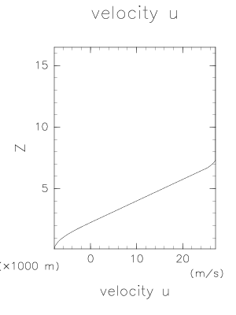
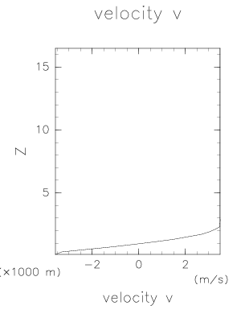
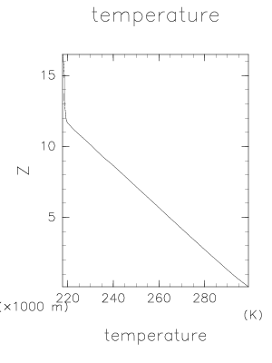
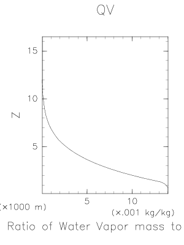
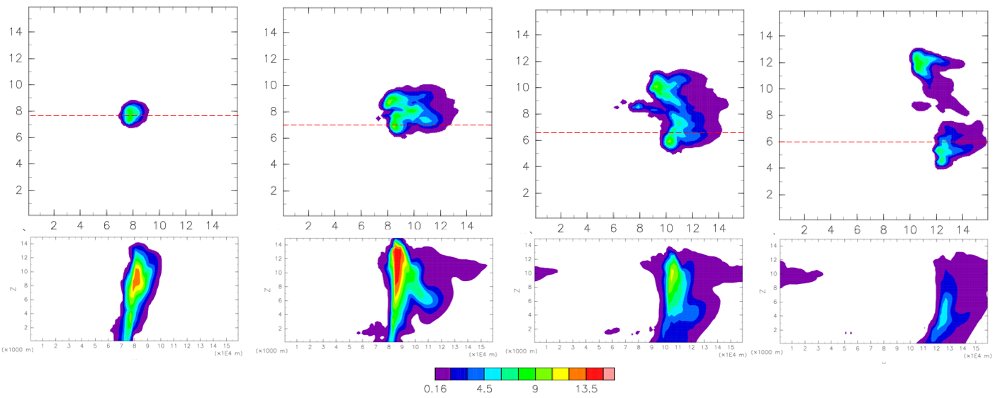

## Overview 

This is an idealized 3-D supercell experiment, using the SCALE-RM testcase `scale-rm/test/case/supercell/2000m_tomita08`.

The panels below show background profiles of U, V, T and QV (water vapor mixing ratio). 
The background dynamical field is characterized by conditionally unstable temperature and humidity profiles and strong vertical wind shear. The initial field is homogeneous in horizontal direction except a Gaussian-shape warm pool imposed near the center of the domain.  




  

The panels below show horizontal cross sections of QHYD (total hydrometeor mixing ratio[kg/g]) at 5000m height (upper panels) and vertical cross sections along red lines (lower panels). From left to right, snapshots at 30, 60, 90, 120 minutes from initial time are shown respectively.  A supercell develops and split into two cells as it moves eastward.   


The default domain size is 160km in X and Y, and 16km in Z. Horizontal boundary conditions are cyclic.  
Grid size is 2000m in horizontal and 200m in vertical. The model uses a single-moment 6-category cloud microphysics scheme (Tomita 2008).    

## Setup 

Copy directories and files in `run/config/supercell` to `run` .  
```
cd scale/run
cp -r config/supercell/* . 
ln -s config.main.FUGAKU config.main  ### Fugaku
ln -s config.main.Linux_torque config.main  ### hibuna
```

Edit `run/config.main` to setup the output path where experiment results are stored. 
```
OUTDIR=/home/$(id -nu)/test_scale/result/supercell ### EDIT HERE ###
```

## Prepare nature run and observation

In this experiment, an idealized observation system simulation experiment (OSSE) is performed.
In OSSE, "nature run" is performed first to create true time series. Then synthetic observation data is generated from the nature run with a specific observation operator and random noise.

### Nature run

Edit `config.fcst` as follows. In this example, forecast and restart data is stored every 5 minutes, assuming standard radar observation frequency.
 
```
STIME='20000101000000'
ETIME=$STIME
TIME_LIMIT='02:00:00'
MEMBERS='mean'
CYCLE=1
CYCLE_SKIP=1
ISTEP=
FSTEP=
CONF_MODE="static"

#===============================================================================
# Forecast settings

FCSTLEN=10800    # SCALE forecast length in the forecast mode (second)
FCSTOUT=300
RESTARTOUT=1800

#===============================================================================

MAKEINIT=1       # 0: No
                 # 1: Yes
```

Execute `fcst_run.sh` again and move to `$OUTDIR`. The resultant files will be considered as restart and history data of the nature run. Rename them as follows. 

```
cd ../../../../result/supercell ### $OUTDIR
mkdir -p nature/init nature/hist
mv 20000101000000/anal/mean/init_*.nc nature/init/
mv 20000101000000/fcst/mean/init_*.nc nature/init/
mv 20000101000000/fcst/mean/history*.nc nature/hist/
```

### Synthetic observation

Prepare 'synthetic' observation based on the nature run history data using the program `scale/obs/obsmake`. First, the location and error of observations need to be specified. There are sample fortran programs in `make_obsin` directory. In this example, use `sample_3dgrid_radar.f90`. This creates an input file for obsmake, with [radar observation format](Observation-file-format.md). Observation points for radar reflectivity and Doppler velocity are set at grid points within 80 km from where the radar is located. Note that this program requires a history file (merged into a single file using SNO) to extract grid information.    

Edit `config.obsmake` as follows.
 
```
#===============================================================================
#
#  Settings for obsmake_run.sh
#
#===============================================================================

STIME='20000101000000'
ETIME='20000101020000'
TIME_LIMIT='01:00:00'
CYCLE=1

BASETIME='20000101000000' ### nature/hist/history.pe000000.nc
FCSTOUT=300

OBSIN=$SCRP_DIR/make_obsin/test_obs_3d_radar.dat
OBS_IN_FORMAT="RADAR"
```
Execute `obsmake_run.sh` and obtain observation files in the path specified by `$OBS` in `config.main`.


## Prepare ensemble of initial states

To initiate a data assimilation cycle, the ensemble of initial model states, in a form of restart files, is necessary. Let us begin the data assimilation cycle from 20000101003000, when the deep convection is in a developing stage. 

A python script `init_perturb/init_perturb.py` is designed to do this task. Modify the setting to fit them to this experiment.   
(*Note that this script is just a simple example, which creates bandpass-filtered global random temperature perturbation. This type of perturbation is different from actual radar data assimilation, where background error has complex multi-scale and non-Gaussian characteristics. The design of initial perturbation should be considered carefully depending on the purpose of the experiment.*)

```
wavel1 =  8000.   ### short-wave cutoff wavelength
wavel2 = 32000.   ### long-wave  cutoff wavelength
dx = 2000.        ### horizontal grid spacing
zheight = 16000.  ### top height for perturbation (can be below the model top)
taper_width = 10  ### number of grid points to suppress perturbation near the lateral boundary
taper_mtop = 10   ### number of grid points to suppress perturbation near the top level

pert_std = 0.2    ### STANDARD DEVIATION (in Kelvin) of temperature perturbation
halo = 2          ### number of grid points for HALO
```

Use the shell script wrapper `init_perturb/init_perturb.sh` to create restart files with random additional perturbations for each member. This script uses `$OUTDIR` and `$MEMBER` in `config.main` and . Only the target time and the path to the source file need to be specified.   
```
cd init_perturb
./init_perturb.sh 20000101003000 ../../../../../result/supercell/nature/init/init_20000101-003000.000
```

## Run a data assimilation cycle

Finally you are ready to start a data assimilation cycle. 
The main settings are in `config.cycle`. Make sure that `MAKEINIT=0` as this experiment uses initial ensemble that has just been created externally. `STIME` is the initial time to start the first cycle, and `ETIME` is for the last cycle. If they are same, only one cycle is performed.

```
STIME='20000101003000'
ETIME='20000101020000'
TIME_LIMIT='01:00:00'

ISTEP=
FSTEP=
CONF_MODE='static'

#===============================================================================

FCSTOUT=

ADAPTINFL=0      # Adaptive inflation
                 #  0: OFF
                 #  1: ON

#===============================================================================

MAKEINIT=0       # 0: No
                 # 1: Yes
```

The periods of the cycle and observation window are set in this part of `config.main`. In this experiment, `LCYCLE` is same with the observation interval which is 1 day. And the rest three parameters are set to be same with `LCYCLE`, which means only the observations at the very time of the analysis will be used (3D-LETKF).

```
LCYCLE=300       # Length of a DA cycle (second)
WINDOW_S=300     # SCALE forecast time when the assimilation window starts (second)
WINDOW_E=300     # SCALE forecast time when the assimilation window ends (second)
LTIMESLOT=300     # Timeslot interval for 4D-LETKF (second)
```

Set config files for your experiment. When radar observation is assimilated, `OBS_IN_FORMAT="RADAR"` in `config.nml.letkf` needs to be set.
```
&PARAM_OBSOPE
!--OBS_IN_NUM--
!--OBS_IN_NAME--
 OBS_IN_FORMAT="RADAR",
!--OBSDA_RUN--
!--HISTORY_IN_BASENAME--
!--SLOT_START--
!--SLOT_END--
!--SLOT_BASE--
!--SLOT_TINTERVAL--
/
```
And it is convenient to set `DEPARTURE_STAT_RADAR = .true.` in `config.nml.letkf` to monitor the result. 
```
&PARAM_LETKF_MONITOR
 DEPARTURE_STAT = .true.
 DEPARTURE_STAT_RADAR = .true.
! DEPARTURE_STAT_T_RANGE = 0.0d0
!--OBSDEP_OUT--
!--OBSDEP_OUT_BASENAME--
/
```
Other LETKF parameters such as localization scale and covariance inflation are also set in `config.nml.letkf`. See [List of variables in config.nml.letkf](List-of-variables-in-config.nml.letkf.md) for the detail. 

Let's run the experiment by executing `cycle_run.sh`. It is recommendable to do it background. 
```
nohup ./cycle_run.sh &> log_cycle_run &
```

While it is running, the progress status can be monitored with the log files of letkf in each cycle created in `$OUTDIR/<time>/log/letkf/`. 
For quick check, find the observation departure statistics in the log file. (The subdomain corresonding to this head-process has no radar observation. The statistics in other processes becomes visible when `LOG_ALL_PRC = .true.` is set in &PARAM_LOG.)

```
OBSERVATIONAL DEPARTURE STATISTICS [GUESS] (IN THIS SUBDOMAIN):
==========================================================================================
                 U           V           T           Q          PS         REF          Vr
------------------------------------------------------------------------------------------
BIAS           N/A         N/A         N/A         N/A         N/A         N/A         N/A
RMSE           N/A         N/A         N/A         N/A         N/A         N/A         N/A
NUMBER           0           0           0           0           0           0           0
==========================================================================================
OBSERVATIONAL DEPARTURE STATISTICS [GUESS] (GLOBAL):
==========================================================================================
                 U           V           T           Q          PS         REF          Vr
------------------------------------------------------------------------------------------
BIAS           N/A         N/A         N/A         N/A         N/A  -1.487E+01   2.293E-01
RMSE           N/A         N/A         N/A         N/A         N/A   1.643E+01   3.809E+00
NUMBER           0           0           0           0           0        6817       10113
==========================================================================================
```

```
OBSERVATIONAL DEPARTURE STATISTICS [ANALYSIS] (IN THIS SUBDOMAIN):
==========================================================================================
                 U           V           T           Q          PS         REF          Vr
------------------------------------------------------------------------------------------
BIAS           N/A         N/A         N/A         N/A         N/A         N/A         N/A
RMSE           N/A         N/A         N/A         N/A         N/A         N/A         N/A
NUMBER           0           0           0           0           0           0           0
==========================================================================================
OBSERVATIONAL DEPARTURE STATISTICS [ANALYSIS] (GLOBAL):
==========================================================================================
                 U           V           T           Q          PS         REF          Vr
------------------------------------------------------------------------------------------
BIAS           N/A         N/A         N/A         N/A         N/A  -1.283E+01   3.219E-01
RMSE           N/A         N/A         N/A         N/A         N/A   1.511E+01   4.005E+00
NUMBER           0           0           0           0           0        6817       10113
==========================================================================================
```
Doppler velocity assimilation seems not successful in this case. 

After the job finishes successfully, first guess and analysis restart files at each analysis time step are stored in `$OUTDIR/<time>/gues/<member>` and `$OUTDIR/<time>/anal/<member>`. 
Output files are separated for each subdomain. You can use `sno` to combine separated files into one. You also have an option to perform regridding with sno plugins.  
